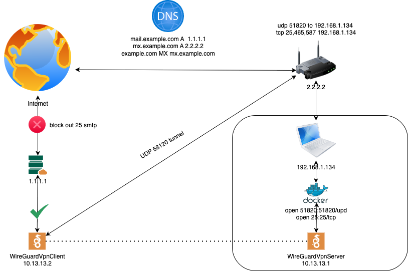

# Zimbra Mail Server and Monitoring Stack Deployment on Yandex Cloud

## Overview  
This guide provides step-by-step instructions for deploying a **Zimbra 8.8.15** mail server and **monitoring stack** on **AlmaLinux 8** using **Terraform** and **Ansible** in **Yandex Cloud**. The stack includes:  

- **AlmaLinux 8** – A stable and secure RHEL-based OS  
- **Zimbra 8.8.15** – Open-source email and collaboration platform  
- **Monitoring Stack** – Prometheus, Grafana, Alertmanager with custom Zimbra exporter  
- **Let's Encrypt** – Free SSL certificates for secure services  
- **Fail2Ban** – Protection against brute-force attacks  
- **WireGuard VPN** – Solution for bypassing Yandex Cloud's SMTP restrictions  
- **Security** – TLS encryption, Basic Auth, and IP-based access control  

---

## Prerequisites

Before proceeding with the installation, ensure you have the following components properly configured:

### 1. Python Environment
- **Python version was used**: 3.11.5  
  Verify with:
  ```bash
  python3 --version
  ```

### 2. Ansible Installation
- **Ansible version was used**: 2.16.14  
  For macOS M1, install using:
  ```bash
  brew install ansible@9
  ```
  Verify with:
  ```bash
  ansible --version
  ```

### 3. DNS Configuration
Configure DNS records for your purchased domain in the public zone. If your domain is already registered, delegate it by specifying Yandex Cloud's name servers in your registrar's NS records:
```
ns1.yandexcloud.net.
ns2.yandexcloud.net.
```
Remove any other existing NS records if delegation was previously configured.

### 4. Terraform Setup
- **[Terraform](https://developer.hashicorp.com/terraform/install) version was used**: 1.11.4  
  Configure the Yandex Cloud provider by creating or editing the Terraform CLI configuration file:
  ```bash
  vim ~/.terraformrc
  ```
  Add the following content:
  ```hcl
  provider_installation {
    network_mirror {
      url = "https://terraform-mirror.yandexcloud.net/"
      include = ["registry.terraform.io/*/*"]
    }
    direct {
      exclude = ["registry.terraform.io/*/*"]
    }
  }
  ```

### 5. Yandex Cloud CLI (YC CLI)
Install the [YC CLI](https://yandex.cloud/en-ru/docs/cli/operations/install-cli) and set up your cloud, folder, and billing account:
```bash
curl -sSL https://storage.yandexcloud.net/yandexcloud-yc/install.sh | bash
```

---

## Installation

### 1 Configure Required Variables
Edit the file [`variables.tf`](./terraform/variables.tf) with the following parameters:
```hcl
variable "domain" {
  description = "Domain name for Zimbra"
  type        = string
  default     = "example.com"
}
variable "domain_l3_mail" {
  description = "Domain l3 mail server"
  type        = string
  default     = "mail"
}
variable "domain_l3_mt" {
  description = "Domain l3 monitoring server"
  type        = string
  default     = "mt"
}
variable "admin_password" {
  description = "Admin password for Zimbra"
  type        = string
  default     = "YourSecurePassword123!"  # Replace with a strong password
}
variable "deploy_zimbra" {
  type        = bool
  default     = true
  description = "Deploy Zimbra server" # True-> If you need deploy zimbra VM
}
variable "deploy_monitoring" {
  type        = bool
  default     = true
  description = "Deploy monitoring server" # True-> If you need deploy monitoring VM
}
```

Edit the file [`monitoring_stack/defaults`](./ansible/roles/monitoring_stack/defaults/main.yml) with the following parameters:
```yaml
# Telegram var for Alertmanager
telegram_bot_token: "1111111111:AAAAAAAAAAAAAAAAAAAAAAAAAAAAAAAAAAA"
telegram_chat_id: "-1111111111"
# Secure: true -> if you want install TLS+BasicAuth+Fail2ban+TrustedNetwork
secure: true
# trusted_ip can be none, you can set your local ip or other who need to access
trusted_ip:
  - "x.x.x.x"
  - "x.x.x.x"
# Auth Configuration
auth_basic_user: "admin"
auth_basic_password: "12345"
ssl_passphrase: "54321"
zimbra_exporter_user: "admin"
zimbra_exporter_pass: "12345"
# SSL
country_name: "RU"
organization_name: "My Organization"
organizational_unit_name: "IT Department"
locality_name: "Moscow"
client_ssl_file_name: "monitoring-client"
```

Edit the file [`zimbra_exporter/defaults`](./ansible/roles/zimbra_exporter/defaults/main.yml) with the following parameters:
```yaml
zimbra_exporter_port: "9095"
cache_tll: "60" # for exporterRequest Cache time to save data
update_interval: "60" # for exporterInterval and exporterSecure time to update data
need_create_ssl: false # true -> for test if you dont have certs
dir_ssl: "/home/almalinux/" # ssl dir
ssl_cert_name: "monitoring-client.crt"
ssl_key_name: "monitoring-client.key"
prometheus_user: "admin" # BaseAuth
prometheus_pass: "12345" # BaseAuth
# trusted_ip only if you want your local machin
trusted_ip:
  - "x.x.x.x"
  - "x.x.x.x"
exporter_type: "exporterSecure"
# exporterInterval   - open http exporter which gives data on Interval
# exporterRequest    - open http exporter which gives data on Request
# exporterSecure     - exporter secure TLS+BaseAuth+TrustedNetwork
# zimbra_exporter    - exporter by Jason Cheng
```

### 2. Set Environment Variables
Terraform automatically picks up variables prefixed with `TF_VAR_`:
```bash
export TF_VAR_yc_token=$(yc iam create-token)
export TF_VAR_yc_cloud_id=$(yc config get cloud-id)
export TF_VAR_yc_folder_id=$(yc config get folder-id)
```

### 3. Deploy Infrastructure
1. **Initialize Terraform**:
   ```bash
   terraform -chdir=./terraform init
   ```

2. **Apply Infrastructure**:
   ```bash
   terraform -chdir=./terraform apply -auto-approve
   ```

3. **Run Ansible Playbook**:
   - To run specific roles (recommended install):
     ```bash
     ansible-playbook -i ./ansible/inventory.ini ./ansible/playbook.yml --tags "zimbra_install,zimbra_letsencrypt,zimbra_exporter,monitoring_stack"
     ```
   - For a full installation:
     ```bash
     ansible-playbook -i ./ansible/inventory.ini ./ansible/playbook.yml --list-tags
     ```
   - To start from a specific task:
     ```bash
     ansible-playbook -i ./ansible/inventory.ini ./ansible/playbook.yml --start-at-task="Update mirrors.list for ClamAV"
     ```
   - All tags
     ```bash
     ansible-playbook -i ./ansible/inventory.ini ./ansible/playbook.yml --list-tags
     
     play #1 (zimbra): Install and configure Zimbra + SSLetsencrypt + fail2ban + vpn_setup + exporter      TAGS: []
     TASK TAGS: [dns, docker, keygen, pack, vpn, vpn_setup, zimbra_exporter, zimbra_fail2ban, zimbra_install, zimbra_letsencrypt]

     play #2 (monitoring): Deploy monitoring system        TAGS: []
     TASK TAGS: [alertmanager, grafana, monitoring_stack, node_exporter, preinstall, prometheus, secure]
     ```
---

## Cleanup
To destroy the infrastructure:
```bash
terraform -chdir=./terraform destroy -auto-approve
```


# Description of services

## Monitoring Stack Architecture

### Custom Zimbra Exporter
The deployment includes a specialized Zimbra exporter with multiple operation modes:

1. **exporterSecure** (Recommended for production):
   - TLS encryption with client certificate authentication
   - HTTP Basic Authentication
   - IP whitelisting (trusted networks only)
   - Auto-updates metrics at fixed intervals

2. **exporterInterval**:
   - Open HTTP endpoint
   - Auto-updates metrics at fixed intervals
   - Suitable for internal monitoring

3. **exporterRequest**:
   - On-demand metric generation
   - No caching, fresh data on each request

4. **[Jason Cheng's Exporter](https://github.com/jasoncheng7115/zimbra_dashboards)**:
   - Compatibility mode with standard zimbra_dashboards
   - Uses Zimbra's native admin APIs

### Integrated Components
- **Prometheus**:
  - Scrapes metrics from zimbra_exporter and node_exporter
  - Stores time-series data with configurable retention
  - Pre-configured alert rules for Zimbra services

- **Grafana**:
  - Pre-loaded Zimbra dashboard (based on [Jason Cheng's](https://github.com/jasoncheng7115/zimbra_dashboards) design)
  - Custom dashboards for server health monitoring
  - Secure access via TLS+Basic Auth

- **Alertmanager**:
  - Integrated with Telegram notifications
  - Dedicated alerts for:
    - Zimbra service outages
    - Disk space thresholds
    - Failed login attempts
    - Certificate expiration

- **Node Exporter**:
  - System-level metrics collection
  - CPU, memory, disk, and network monitoring

---

## Security Implementation

### 1. Transport Layer Security (TLS)
All components enforce HTTPS with:
- Auto-generated self-signed certificates during deployment
- Option to replace with Let's Encrypt certificates
- Strict TLS 1.2+ configuration
- Certificate pinning for internal services

### 2. Authentication
- **Basic Auth** for all web interfaces (Grafana, Prometheus, Alertmanager)
- Separate credential sets for:
  - Admin users (full access)
  - Read-only users (monitoring only)
- Password hashing with bcrypt

### 3. Network Security
- **IP Whitelisting** for sensitive endpoints:
  ```yaml
  trusted_ip:
    - "x.x.x.x"  # Admin workstation
    - "x.x.x.x"  # Backup server
  ```
  
## Monitoring Stack Configuration

### Accessing the Interfaces if secure: false 
1. **Grafana**: `http://mt.yourdomain.com:3000`
2. **Prometheus**: `http://mt.yourdomain.com:9090/metrics`
3. **Alertmanager**: `http://mt.yourdomain.com:9093/metrics`
4. **Node-exporter**: `http://mt.yourdomain.com:9100/metrics`
5. **Zimbra-exporter**: `http://mail.yourdomain.com:9095/metrics`
5. 
### Accessing the Interfaces if secure: true 
1. **Grafana**: `https://mt.yourdomain.com/`
2. **Prometheus**: `https://mt.yourdomain.com/prometheus/metrics`
3. **Alertmanager**: `https://mt.yourdomain.com/alertmanager/metrics`
4. **Node-exporter**: `https://mt.yourdomain.com/node-exporter/metrics`
5. **Zimbra-exporter**: `https://mail.yourdomain.com:9095/metrics`

### Useful Commands
Check exporter status:
```bash
sudo journalctl -u zimbra_exporter.service -f
tail -f /var/log/zimbra_exporter.log
sudo systemctl restart zimbra_exporter
sudo systemctl status zimbra_exporter
```

---
## Bypassing Yandex Cloud's Outbound Port 25 Block

**Important Notice**: This solution is specifically designed for **testing purposes only** to verify Zimbra mail server functionality when deployed in Yandex Cloud (YC). It is not recommended for production environments due to potential performance limitations and security considerations.

The implementation establishes a WireGuard VPN tunnel between your YC instance and a local network with a static public IP address to bypass YC's outbound port 25 restrictions.

## Limitations and Production Considerations

1. **Testing Purpose Only**:
   - This solution is designed specifically for testing Zimbra functionality
   - Not recommended for production mail servers
   - VPN tunnel may become a bottleneck for mail traffic

2. **Production Alternatives**:
   - Consider using YC's approved mail delivery services
   - Implement a mail relay service outside of YC
   - Use alternative ports with TLS encryption if supported
   - Apply for YC's port 25 unblocking for legitimate mail servers

3. **Performance Notes**:
   - Tunnel bandwidth depends on your local internet connection
   - Latency may affect mail delivery times
   - Not suitable for high-volume mail traffic

### Architecture



### Prerequisites

Before installation, ensure you have:

1. A static public IP address on your router
2. The following ports forwarded from your router to your local machine:
   - TCP 25 (for SMTP traffic)
   - UDP 51820 (for WireGuard VPN)
3. Docker and Docker Compose installed on your local machine
   - [Installation guide](https://docs.docker.com/compose/install/)
4. Need install `wireguard-tools` package on local machine (for key generation and management) 
5. Zimbra installed via the provided Ansible [`playbook`](./ansible/playbook.yml)

### Installation
**Configuration**

1. Edit the [`main.yml`](./ansible/roles/vpn_setup/vars/main.yml) configuration file:
   ```yaml
   rout_public_ip: "x.x.x.x"  # Replace with your actual static IP
   ```

**Deployment**

Run the Ansible playbook to set up the VPN:

```bash
ansible-playbook -i ./ansible/inventory.ini ./ansible/vpn_setup.yml
```

**Verification**

After installation y can see stdout ansible tests or:

1. Verify the VPN connection is established
   ```bash
   sudo wg show
   ```
2. Test outbound SMTP traffic on port 25
   ```bash
   telnet your.mail.server 25
   ```
3. Confirm email delivery is functioning as expected
    ```bash
    tail -f /var/log/zimbra.log
    ```

---

## Stack Details

### **AlmaLinux 8**
- Base OS for stability and long-term support.
- Pre-configured with security updates.

### **Zimbra 8.8.15**
- Includes:
  - Webmail (Zimbra Web Client).
  - Calendar, Contacts, and Tasks.
  - IMAP/POP3/SMTP services.

### **Let’s Encrypt**
- Automatically provisions SSL certificates for:
  - `https://mail.example.com`
  - SMTP/IMAP encryption.

### **Fail2Ban**
- Blocks brute-force attacks on:
  - SSH.
  - Zimbra Admin Console.
  - SMTP/IMAP login attempts.

### **WireGuard VPN**  
- Lightweight, high-performance VPN tunnel for bypassing YC’s port 25 restrictions:  
  - **Protocol**: UDP (Port `51820` forwarded on home router).  
  - **Encryption**: ChaCha20-Poly1305 for secure traffic forwarding.  
  - **Key Management**: Ephemeral keys generated during Ansible setup.  
  - **Traffic Routing**: Selective routing for SMTP (TCP/25) only.  
  - **NAT Traversal**: Built-in support for home networks behind CG-NAT. 

### **Custom Zimbra Exporter**
- Multi-mode monitoring agent for Zimbra metrics:
  - **Secure Mode**: TLS+BasicAuth+IP whitelisting
  - **Interval Mode**: Auto-refreshing metrics cache
  - **Request Mode**: On-demand metric generation
- Pre-configured dashboards compatible with [Jason Cheng's](https://github.com/jasoncheng7115/zimbra_dashboards) templates
- Logging to `/var/log/zimbra_exporter.log`

### **Prometheus**
- Metrics collection with scrape intervals
- Pre-configured alerts for:
  - Zimbra service status
  - Queue lengths
  - LDAP replication health
- Secure endpoint with Basic Auth

### **Grafana**
- Pre-loaded dashboards:
  - Zimbra Cluster Overview
  - Mail Queue Monitoring
  - System Resources
- Auto-configured Prometheus datasource

### **Alertmanager**
- Telegram integration with templated alerts
- Dedicated routing for:
  - Critical (24/7 notifications)
  - Warnings (business hours only)
- Silence management via web UI

### **Node Exporter**
- System-level metrics collection:
  - Disk I/O for `/opt/zimbra`
  - Zimbra process memory usage
  - Network throughput per interface
- Filtered to exclude sensitive kernel metrics

### **Security Layer**
- **TLS Everywhere**:
  - Auto-generated certs with 398-day validity
  - Strict cipher suite policies
- **Trusted Networks**:
  - Dual-level IP whitelisting (instance+application)
  - Fail2Ban integration for brute force protection
- **Auth Framework**:
  - Role-based access control
  - Credential encryption in configs
  - Session invalidation on IP change
---

## Notes
- Ensure all prerequisites are met before starting the installation.
- Replace placeholder values (e.g., domain name, password) with your actual configurations.
- For troubleshooting, refer to the logs generated during the Terraform and Ansible execution.
- Access Zimbra Admin Console at `https://mail.example.com:7071`.
- Monitor Fail2Ban logs:
  ```bash
  journalctl -u fail2ban -f
  ```